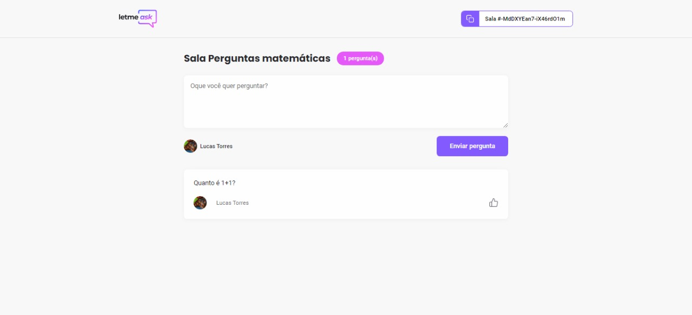
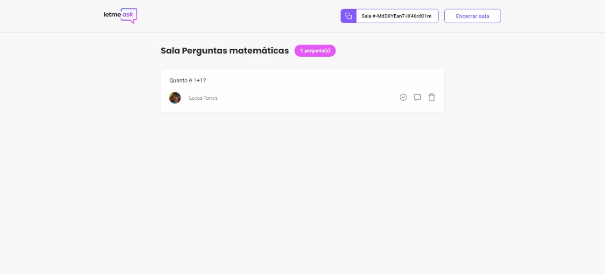

## 🧪 Tecnologias

- ReactJS
- Firebase
- Typescript

## 🚀 Guia de instalação 

- Clone o projeto
```bash 
  $ git clone git clone https://github.com/Lucas340/next-level-week-6
  $ cd next-level-week-6
```

- Instale as dependências
```bash
  $ yarn
```

- Iniciar o projeto
```bash
  $ yarn start
```


    
## 📌 Observações

- Lembre-se de preencher o arquivo `.env` para executar a aplicação (você pode seguir o [exemplo](https://github.com/Lucas340/next-level-week-6/blob/main/.env.example)) 

  
## 🚧 Recursos

- [X] Logar
- [X] Criar uma sala
- [X] Entrar numa sala
- [X] Criar uma pergunta
- [X] Deletar uma pergunta
- [X] Curtir uma pergunta
- [X] Deixar uma pergunta destacada
- [ ] Traduzir a aplicação
- [ ] Responsividade
- [ ] Dark Mode
- [ ] Pagina de "não autorizado"
- [ ] Pagina de "não encontrado"
- [ ] Modal
  
## 👷 Autores

- [@Lucas340](https://www.github.com/lucas340)

  
## 💄 Screenshots






## 💜 Feito com a Rocketseat

Esse projeto foi feito durante o evento [`Next Level Week 6 - Together`](https://github.com/rocketseat-education/nlw-06-reactjs)

  